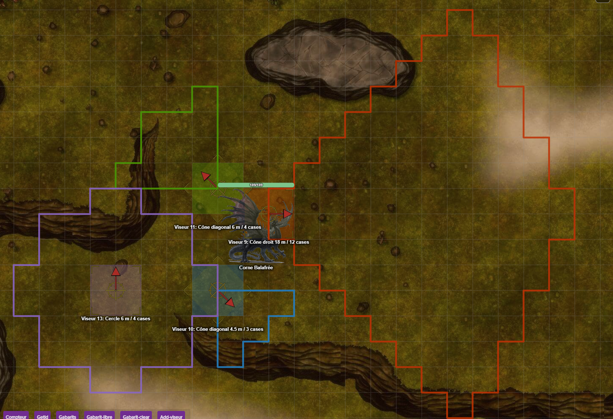

# roll20
My roll20 shit

[Version française](README_fr.md)

## Area-of-effect templates (Pathfinder 1e)

`scripts/gabarit.js` draws area-of-effect templates on the map (burst, cone, line, emanation) following the official
Pathfinder 1e rules: the outline follows the exact borders of the squares touched (square counting, every second
diagonal counts double), not an approximate circle. Sizes can be given in squares, feet or meters and are converted to
squares, so the map scale has no influence (5 ft = 1.5 m = 1 square).

*Four templates at once on a map in meters: straight 18 m cone (red), diagonal 6 m cone (green), diagonal 4.5 m cone (blue) and 6 m burst (purple). Each has its own Aimer, whose arrow shows the direction.*

**Installation**
1. Paste `scripts/gabarit.js` into a new API script (Game Settings > API Scripts) and save.
2. Import `macro/viseur.png` into your Roll20 library (not from the Marketplace), place it on the map, select it, then
   type `!gabarit viseurimg` (GM). Without this, the script uses a fallback image tinted red.
3. Create a macro named "Gabarit", visible to all, with the content of `macro/gabarit.macro.txt`.

**Use (player)**: select your token, click "Gabarit", then pick the shape and size from the lists. An Aimer (one per
template, in the template's color) appears next to the character.
- Burst: the circle is centered on the Aimer.
- Straight cone, diagonal cone, line: the template starts from the Aimer. Rotate it (E key + mouse wheel, in 45° steps)
  to choose the direction; the rotation snaps to valid directions.
- Emanation: starts from the edges of the caster's square.
- Several templates can stay on the map at the same time. Use "Effacer" (clear) in the message you received, or delete the Aimer.

| Command | Effect |
| --- | --- |
| `!gabarit lancer <caster id> <shape> <size> [color=feu] [duree=60]` | Creates the template and its Aimer. Shapes: `burst`, `conedroit`, `conediag`, `ligne`, `emanation`. Size: `4c` (squares), `6m`, `20ft` or `20`. |
| `!gabarit clear [gN]` | Clears one template, or all of the player's templates. |
| `!gabarit clear tout` | GM: clears all templates. |
| `!gabarit viseurimg` | GM: saves the selected token as the Aimer image. |

**Tests**: `node tests/gabarit.test.js` (Node, no dependency) runs 214 checks: size conversion, shapes and square
counts, outlines, then the full flow with a fake Roll20. They are no substitute for a try-out in a real campaign.

## Random weather (Climat)

`scripts/Climat.js` draws random weather by heat level (very cold, cold, temperate, hot, very hot) rather than by
region, so it also works outside Golarion. Each day is split into 4 phases (morning, afternoon, evening, night), each
with its own temperature. Phenomena (rain, snow, fog, hail, thunderstorm, snowstorm, blizzard, hurricane, tornado,
sandstorm, torrential rain) have warning signs, a start time and a duration drawn from the Climat page of the
Pathfinder-FR wiki. They can carry over onto the following days. Heat waves, cold waves and the desert wind last 3 days.
If a drawn phenomenon runs past the number of days requested, the period is extended until it ends (5 days at most) and
the card says so. The script handles no game mechanics, only text and temperatures. It keeps no state.

**Installation**: paste `scripts/Climat.js` (and only that file, not the test file) into a new API script and save.
Create the "Climat" macro with the content of `macro/Climat.macro.txt` (`!climat`).

**Use (GM)**: click "Climat", choose the heat level, then a month (one day) or "Plusieurs jours" (several days, 1 to 14).

| Command | Effect |
| --- | --- |
| `!climat` | Heat level buttons. |
| `!region <level>` | Month buttons for that level. |
| `!RollClimat <level> <month> [days]` | Draws the weather (e.g. `!RollClimat froid neth 3`). Argument order is free. |

The level ids are `tresfroid`, `froid`, `tempere`, `chaud` and `treschaud`, and months use their Golarion names (Abadius, Calistril, Pharast...).

**Tests**: `node tests/Climat.test.js` (Node, no dependency) runs 305 checks: scripted dice, statistical properties over
tens of thousands of days, then the full flow with a fake Roll20. They are no substitute for a try-out in a real game.

## Character tools (API scripts, GM only)

Three small scripts to inspect a character's attributes from the server side, without opening its
sheet in a browser. Opening a sheet from a session that did not receive the character's attributes
makes the Pathfinder sheet recreate its default attributes, which leaves duplicates behind.
Paste each file from `scripts/` in a new API script (Game Settings > API Scripts), save, restart the sandbox.

| Script | Command | Effect |
| --- | --- | --- |
| `pjinfo.js` | `!pjinfo Nom du Personnage` | Read-only. Whispers race, level, alignment, deity, age, languages, classes, ability names, number of duplicated attributes and of same-named handouts. |
| `dupes.js` | `!dupes Nom du Personnage [tout]` | Read-only. Groups duplicated attribute names, compares values, and decodes the creation date from the Firebase-style ids to tell the oldest copy from the recent ones. |
| `dedup.js` | `!dedup Nom du Personnage` then `!dedup Nom du Personnage confirmer N` | Deletes duplicates. Dry run by default; deletion only with the exact count shown by the dry run. |
| `tokeninfo.js` | `!tokeninfo Nom du Personnage`, `!tokenwatch on\|off` | Read-only diagnostic for token naming. `!tokeninfo` shows the default token's name, its bar links and the tokens already placed. `!tokenwatch` whispers each token creation and every rename (old and new name) for 15 minutes, to find which script renames tokens. |
| `attrscan.js` | `!attrscan Nom du Personnage [section]` | Read-only. Counts attributes, repeating-section rows (and empty ones), "macro" attributes, longest values and most frequent name prefixes. With a section name (for example `ability`), shows each field and its most frequent short values. |
| `attrscan.js` | `!abilitycheck Nom du Personnage` | Read-only. Applies the Pathfinder Community sheet's own rule (`PFAbility.getTopOfMenu`): lists abilities shown in the menu (`showinmenu` true) whose `ability_type` is missing or not Ex/Sp/Su. Those rows make the sheet log `could not find top macro for 0` in a loop and slow the page down. |
| `abilityfix.js` | `!abilityfix Nom du Personnage` then `!abilityfix Nom du Personnage confirmer N` | Sets `showinmenu` to 0 on exactly those rows (they leave the chat ability menu, nothing else changes). Dry run by default; applies only with the exact count shown by the dry run. Try it on a duplicate of the character first. |

`dedup.js` keeps the oldest copy of every attribute and only removes recent copies created inside
`WINDOW_FROM`..`WINDOW_TO` (UTC, edit them at the top of the file) that have the same value and max as the
kept one. It never touches `repeating_` sections. Run `dupes.js` first to pick the window, and
duplicate the character beforehand if you want a backup.

## Slow page after editing a token of a PC

Symptom: renaming or editing a token that represents a Pathfinder Community character freezes the page for a long
time, with `could not find top macro for 0` repeating in the browser console. Cause: an ability with `showinmenu`
true and an empty or missing type is read as type "0" by the sheet worker (`getTopOfMenu`). Run
`!abilitycheck <character>`, then `!abilityfix <character>` (dry run first). A separate note: PFCompanion's
"Mook Numbering" can wrongly number PC tokens (`Name 1`); see `!tokeninfo` and `!tokenwatch`.

**Folders**: `scripts/` (API scripts), `tests/` (Node tests of the scripts), `macro/` (macros and related images).
The macros are the `*.macro.txt` files: their content is pasted as is into a Roll20 macro. What each macro does and
which scripts it depends on is listed in [`macro/README.md`](macro/README.md) (in French).
